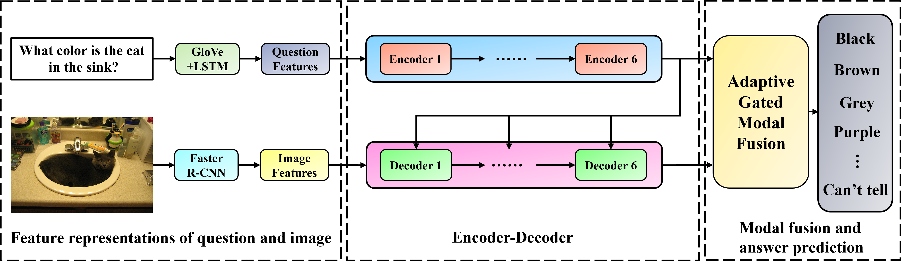

# MAGM
The source code for our [article](https://journals.plos.org/plosone/article?id=10.1371/journal.pone.0287557) "Multi-modal adaptive gated mechanism for visual question answering".

Abstract: 
Visual Question Answering (VQA) is a multimodal task that uses natural language to ask and answer questions based on image content. For multimodal tasks, obtaining accurate modality feature information is crucial. The existing researches on the visual question answering model mainly start from the perspective of attention mechanism and multimodal fusion, which will tend to ignore the impact of modal interaction learning and the introduction of noise information in the process of modal fusion on the overall performance of the model. This paper proposes a novel and efficient multimodal adaptive gated mechanism model, MAGM. The model adds an adaptive gate mechanism to the intra- and inter-modality learning and the modal fusion process. This model can effectively filter irrelevant noise information, obtain fine-grained modal features, and improve the ability of the model to adaptively control the contribution of the two modal features to the predicted answer. In intra- and inter-modality learning modules, the self-attention gated and self-guided-attention gated units are designed to filter text and image features’ noise information effectively. In modal fusion module, the adaptive gated modal feature fusion structure is designed to obtain fine-grained modal features and improve the accuracy of the model in answering questions. Quantitative and qualitative experiments on the two VQA task benchmark datasets, VQA 2.0 and GQA, proved that the method in this paper is superior to the existing methods. The MAGM model has an overall accuracy of 71.30% on the VQA 2.0 dataset and an overall accuracy of 57.57% on the GQA dataset.

<p align="center">
	
</p>

To run this code, you may refer to the relevant content on [MCAN](https://github.com/MILVLG/mcan-vqa) and [OpenVQA](https://github.com/MILVLG/openvqa) or their [MODEL ZOO](https://openvqa.readthedocs.io/en/latest/basic/model_zoo.html).

#### Offline Evaluation

Offline evaluation only support the VQA 2.0 *val* split. If you want to evaluate on the VQA 2.0 *test-dev* or *test-std* split, please see [Online Evaluation](#Online-Evaluation).

There are two ways to start:

(Recommend)

```bash
$ python3 run.py --RUN='val' --CKPT_V=str --CKPT_E=int
```

or use the absolute path instead:

```bash
$ python3 run.py --RUN='val' --CKPT_PATH=str
```

#### Online Evaluation

The evaluations of both the VQA 2.0 *test-dev* and *test-std* splits are run as follows:

```bash
$ python3 run.py --RUN='test' --CKPT_V=str --CKPT_E=int
```

Result files are stored in ```results/result_test/result_run_<'PATH+random number' or 'VERSION+EPOCH'>.json```

You can upload the obtained result json file to [Eval AI](https://eval.ai/web/challenges/challenge-page/830/overview) to evaluate the scores on *test-dev* and *test-std* splits.

# Citation
If this repository is helpful for your research, we'd really appreciate it if you could cite the following paper:
```
@article{xu2023multi,
  title={Multi-modal adaptive gated mechanism for visual question answering},
  author={Xu, Yangshuyi and Zhang, Lin and Shen, Xiang},
  journal={Plos one},
  volume={18},
  number={6},
  pages={e0287557},
  year={2023},
  publisher={Public Library of Science San Francisco, CA USA}
}
```
